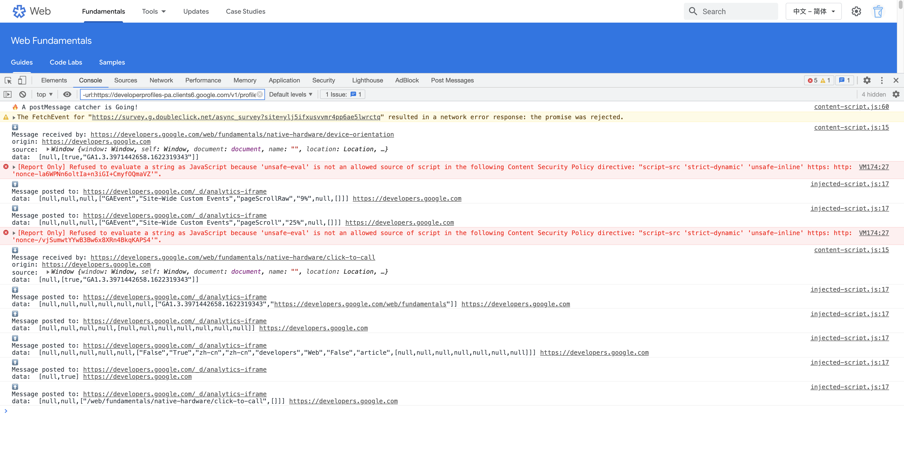

# postMessage-catcher

A Chrome extension for capturing and monitoring postMessage communication in web pages.

## 🚀 Features

- Real-time capture of incoming postMessage events
- Logging of outgoing postMessage calls from the current page
- Comprehensive message logging viewable in browser console (F12)

## 📦 Installation

### Chrome Web Store

Install directly from the [Chrome Web Store](https://chrome.google.com/webstore/detail/postmessage-catcher/henlmhlhpgnkeecjjcbhhcfmecohnilo).

### Manual Installation

1. Download the extension package from `assets/postMessage-catcher.zip`
2. Navigate to `chrome://extensions/` in your Chrome browser
3. Enable "Developer mode" in the top right corner
4. Click "Load unpacked" and select the extracted extension folder

## 📸 Screenshot

## 🤝 Contributing

Contributions are welcome! Here's how you can help:

1. Fork the repository
2. Create your feature branch (`git checkout -b feature/amazing-feature`)
3. Commit your changes (`git commit -m 'Add some amazing feature'`)
4. Push to the branch (`git push origin feature/amazing-feature`)
5. Open a Pull Request

### Development Setup

1. Clone the repository
3. Test the extension locally by loading it as an unpacked extension
4. Ensure your code follows the existing style

## ❤️ Credits

This extension was inspired by [postMessage-logger](https://github.com/opnsec/postMessage-logger).

Special thanks to these excellent resources:

- [Chrome Extensions Documentation](https://developer.chrome.com/docs/extensions/)
- [chrome-plugin-demo](https://github.com/sxei/chrome-plugin-demo)
- [youtube-translator](https://github.com/bugushi/youtube-translator)

## 📄 License

This project is licensed under the MIT License - see the [LICENSE](./LICENSE) file for details.
